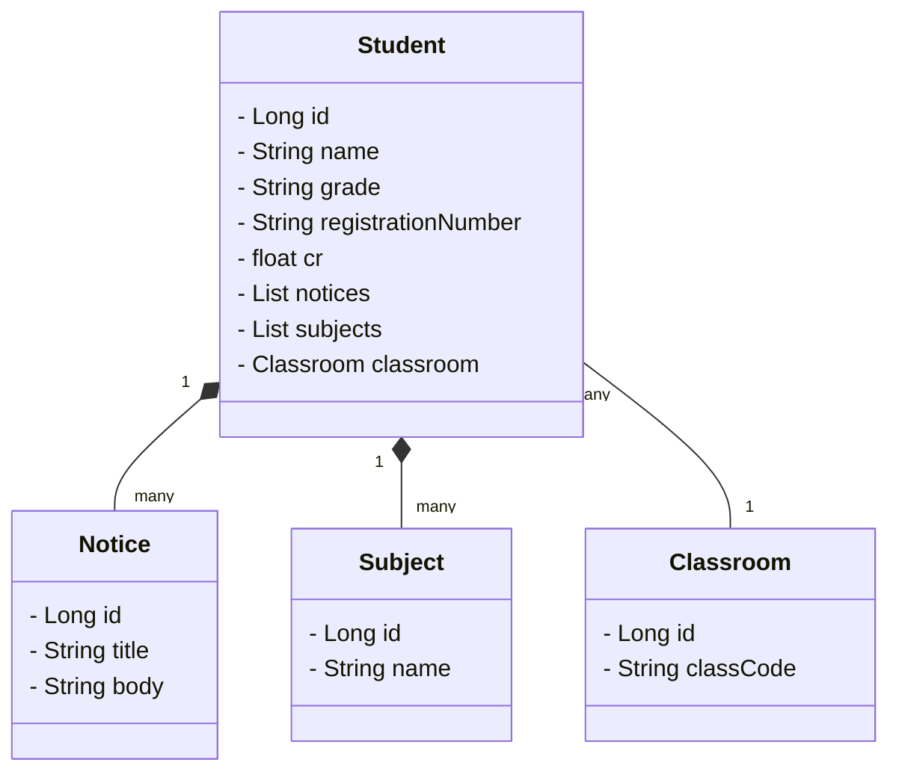

# API para sistema escolar

## Descrição

Uma api Básica com o intuito de implementar uma tela de aluno em um sistema.

## Modelo

O modelo da página foi criado no figma e pode ser encontrado [aqui](https://www.figma.com/file/JmTG3CDK5viEAyAVShfdjc/Modelo_aplicativo_escolar?type=design&node-id=0%3A1&mode=design&t=ZH6NuBff9MuaeULY-1).


## Diagrama de classes



## Endpoints
Get - /aluno/{id}

Post - /aluno

Delete - /aluno/id

## Exemplo de uso

Criação de estudante em Json
```json
{
  "id": 1,
  "name": "Patrick",
  "grade": "9º ano",
  "registrationNumber": "144192",
  "cr": 9.5,
  "notices": [
    {
      "id": 1,
      "title": "Aviso 1",
      "body": "Este é o primeiro aviso."
    },
    {
      "id": 2,
      "title": "Aviso 2",
      "body": "Este é o segundo aviso."
    }
  ],
  "subjects": [
    {
      "id": 1,
      "name": "Matemática"
    },
    {
      "id": 2,
      "name": "História"
    }
  ],
  "classroom": {
    "id": 1,
    "classCode": "T902"
  }
}
```

## TODO
- Adcionar Curriculo como uma classe com matérias e notas
- Adcionar Professor, com um professor podendo dar aula pra uma matéria e uma matéria podendo ter vários professores.
