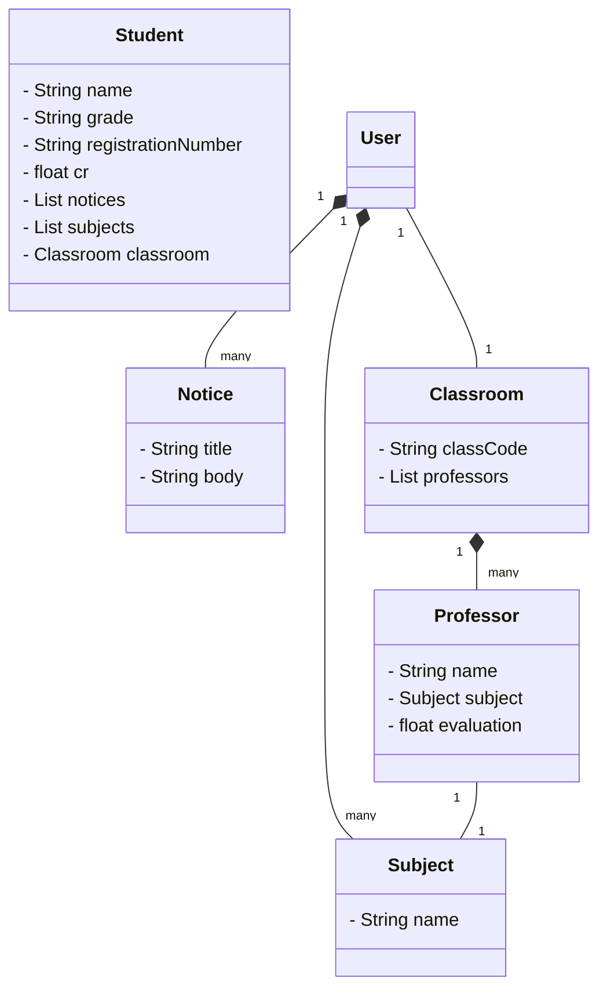

# API para sistema escolar

## Descrição

Uma api Básica com o intuito de implementar uma tela de aluno em um sistema.

## Modelo

O modelo da página foi criado no figma e pode ser encontrado [aqui](https://www.figma.com/file/JmTG3CDK5viEAyAVShfdjc/Modelo_aplicativo_escolar?type=design&node-id=0%3A1&mode=design&t=ZH6NuBff9MuaeULY-1).

## Diagrama de classes

## Endpoints
